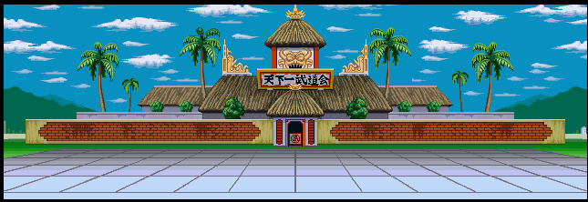
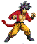
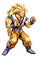
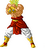

<h1>======Jeu Dragon Ball Z =======</h1> 

Ce jeu se joue seul , et est le debut d'un jeu de combat ultra classique Dragon BallZ
Vous incarnez le personnage de Sangoku SSJ 4 OU Vegeta Magin et vous vous battrez contre le 
ssj Légendaire Broly.
<h3>combattez dans une arene de combat legendaire </h3>
 

===Les touches====
 

<em>Eventuellement</em> : 

Pour Sangoku : a = frapper
			b = recharger sa vie
			c= Kamehameha
			d = redevenir ssj3
 

Pour Vegeta : a= frapper 
		    b=charger sa vie

Pour changer de personnage modifier la <code>String Personnage</code> dans Applica.java

Broly (l'adversaire) : 

#Credit
Dragon Ball Z est une oeuvre de Akira toriyama,les images sont tirés de Dragon Ball hyper Dimension

